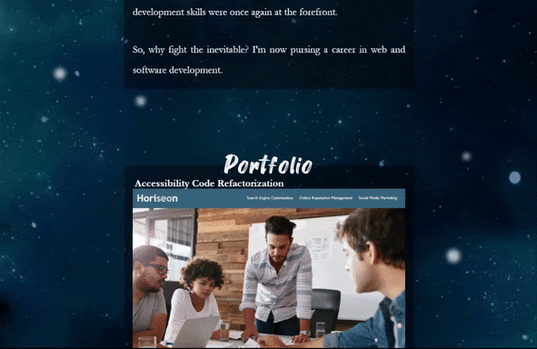

# Professional Portfolio Page

This is my professional portfolio website. It displays my portfolio of coding and design work, while also showcasing my skills for HTML and CSS styling, and graphic design sensibilities. There are also links to my CV and various contact methods.

### Dynamic Scaling

This page scales content and the content proportion of the screen to ideally utilize the space of various screen sizes. Additionally, the navigation bar at the top will reorganize itself into an even-rowed grid when the viewport width is narrow enough that the row must wrap.

### Parallax Scrolling

Parallax scrolling effects are a popular method of adding visual interest to a webpage's design. Parallaxing of background, midground, and foreground elements in different planes allows for a sense of depth while scrolling through the page.

---

## Getting Started

These instructions will get you a copy of the project up and running on your local machine for development and testing purposes. See deployment for notes on how to deploy the project on a live system.

### Prerequisites

* IDE to view/edit source code (e.g. Visual Studio Code).

### Installing

1. Clone repository.
1. Open [index.html](index.html) in web browser.

### Deployment

1. Upload index.html and assets folder to webhosting site, such as GitHub.
1. If using GitHub, deploy via GitHub Pages.

---

## Built With

* [HTML](https://developer.mozilla.org/en-US/docs/Web/HTML)
* [CSS](https://developer.mozilla.org/en-US/docs/Web/CSS)
* [GitHub](https://github.com/)

## Deployed Page

* [See Live Site](https://starryblue7.github.io/portfolio/)

## Author

Vince Lee
- [Portfolio](https://starryblue7.github.io/portfolio/)
- [Github](https://github.com/StarryBlue7)
- [LinkedIn](https://www.linkedin.com/in/vince-lee/)

## Acknowledgments

* Parallax behavior inspired by article ["Pure CSS Parallax"](https://medium.com/@dailyfire/pure-css-parallax-simple-tricks-da102d0ffdb9) on Medium by Daily Fire.
* Page and element scaling based largely in use of [Flexbox](https://dev.to/rleggos/how-to-make-emojis-accessible-in-html-2n7).
